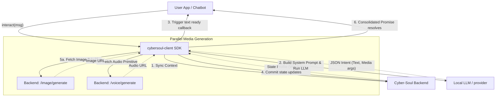

# @space3-npm/cybersoul-client

`@space3-npm/cybersoul-client` is the official TypeScript client SDK for interacting with the Cyber-Soul backend service. It acts as the "Brain" orchestrator on the client side, converting your local text inputs into rich, multi-modal outputs (text, voice, and image) driven by an LLM architecture.

## Overview

Cyber-Soul Service transforms static text-based virtual companions into fully realized, multi-modal emotional personas. The `cybersoul-client` sits between your user-facing application (or OpenClaw agent) and the Cyber-Soul backend infrastructure.

### The Role of the SDK in the Architecture

1. **Context Management & Synchronization**: The client synchronizes the character's remote state (relationship stage, active daily events, current wardrobe) and merges it with local context.
2. **Local LLM Execution (BYOK)**: It securely utilizes the developer's provided LLM API key (e.g., MiniMax) locally. This keeps the heaviest cognitive lifting decoupled from the core database backend, letting the user control the underlying intelligence layer.
3. **Intent Parsing**: The LLM evaluates the chat context and returns a structured JSON intent determining what modalities are necessary (e.g., if a user asked for a photo, the LLM sets `imageParams`; if the relationship progressed, it creates a `stateUpdate`).
4. **Primitive Orchestration**: The SDK orchestrates low-level generation operations in parallel against the Cyber-Soul backend:
   - Evaluates `stateUpdate` and fires a `PATCH` request to persist emotional inertia remotely.
   - Generates images via `/api/v1/cyber-soul/image/generate`.
   - Synthesizes speech via `/api/v1/cyber-soul/voice/generate`.
5. **Consolidated Delivery**: Once all operations complete, it returns a clean, unified payload ready for UI rendering.

## Installation

**Prerequisites:** This SDK uses the native `fetch` API and requires **Node.js 18 or higher** (or a modern browser environment).

You can install the SDK locally or via npm:

```bash
npm install @space3-npm/cybersoul-client
```

## Quick Start

Initialize the client with your Character Key (provided by your Cyber-Soul Dashboard) and your local LLM configuration:

```typescript
import { CyberSoulClient } from '@space3-npm/cybersoul-client';

const client = new CyberSoulClient({
  characterKey: 'YOUR_CHARACTER_KEY_HASH', // Ties requests to your specific Cyber-Soul persona
  backendUrl: 'https://space3.cloud',      // The Cyber-Soul core service URL (e.g., http://localhost:3002 for local dev)
  llmConfig: {
    provider: 'minimax',
    apiKey: 'YOUR_MINIMAX_API_KEY',
    model: 'MiniMax-M2.7'
  }
});

// Interact with your Cyber-Soul
const response = await client.interact({
  userMessage: "Good morning! Can you send me a quick selfie before work?",
  requestTypes: ['auto'], // Can force 'text', 'image', or 'voice'. 'auto' lets the LLM decide.
  history: [
    { role: 'user', content: 'See you tomorrow!' },
    { role: 'assistant', content: 'Goodnight! Sweet dreams.' }
  ],
  onTextReady: (text) => {
    // Fired immediately as soon as the text intent is parsed from the LLM, 
    // before waiting for heavy media generations (voice/image) to complete.
    console.log("Instant text response:", text);
  }
});

if (response.status === 'success') {
  console.log("Final text:", response.textResponse);
  if (response.imageUrl) console.log("Image attached:", response.imageUrl);
  if (response.audioUrl) console.log("Audio attached:", response.audioUrl, "Duration:", response.durationSec);
}
```

## How It Works Under The Hood



## Usage in Custom Applications (OpenClaw / Frontend)

When plugging this SDK into an existing bot framework like OpenClaw, you will generally bootstrap the system once with your config files, then call `.interact()` on every new message event. 

Because `interact` acts as an all-in-one state-machine adapter, it isolates multi-modal state tracking—you simply provide the raw user string and the array of recent history, and the SDK takes care of API generation, prompt construction, and relationship temperature updates implicitly.

## API Reference

The SDK perfectly mirrors the underlying Cyber-Soul backend capabilities via typed TypeScript primitives:

- `getState()`: Fetches the current dynamic context, relationship stage, next events, and wardrobe metadata.
- `updateDynamicContext(stateUpdate)`: Manually patches the character's relationship temperature or mood delta.
- `generateImage(params)`: Synthesizes a new explicit image of the character outside of standard chat flow logic.
- `generateVoice(params)`: Synthesizes explicit character audio (ElevenLabs/TTS) returning the URL and duration.
- `giftOutfit(descriptionText)`: Provisions a new explicit outfit descriptor to the character's backend inventory.
- `bootstrapCharacter(workspaceFiles)`: Automates character profile and prompt setup directly from local markdown configuration files.
- `generateDailyScript()`: Cron-job helper instructing the AI scheduling system to compute the next block of dynamic events and plans.
- `interact(params)`: The primary orchestrated multi-modal dialogue endpoint processing standard human <-> agent chat requests.
- `ondemandEvent(params)`: Evaluates and triggers an on-demand event, using the LLM to intelligently decide if the character accepts the event and whether an outfit change is appropriate.
- `consolidateCoreMemory(input)`: Uses edge LLM logic to merge recent events with the character's core memory and synchronizes the updated memory to the remote database.